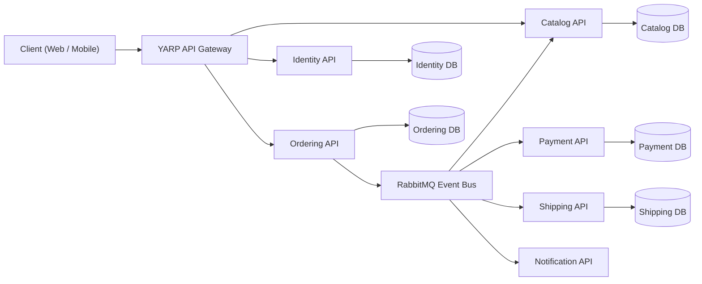
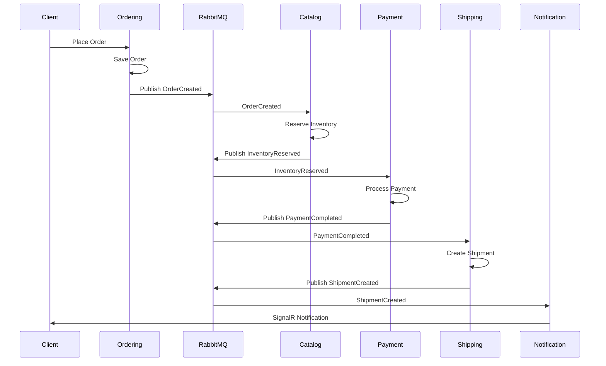
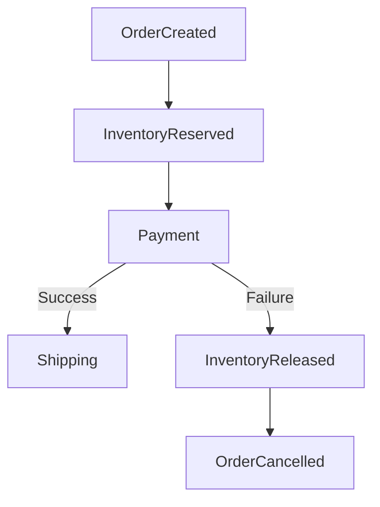
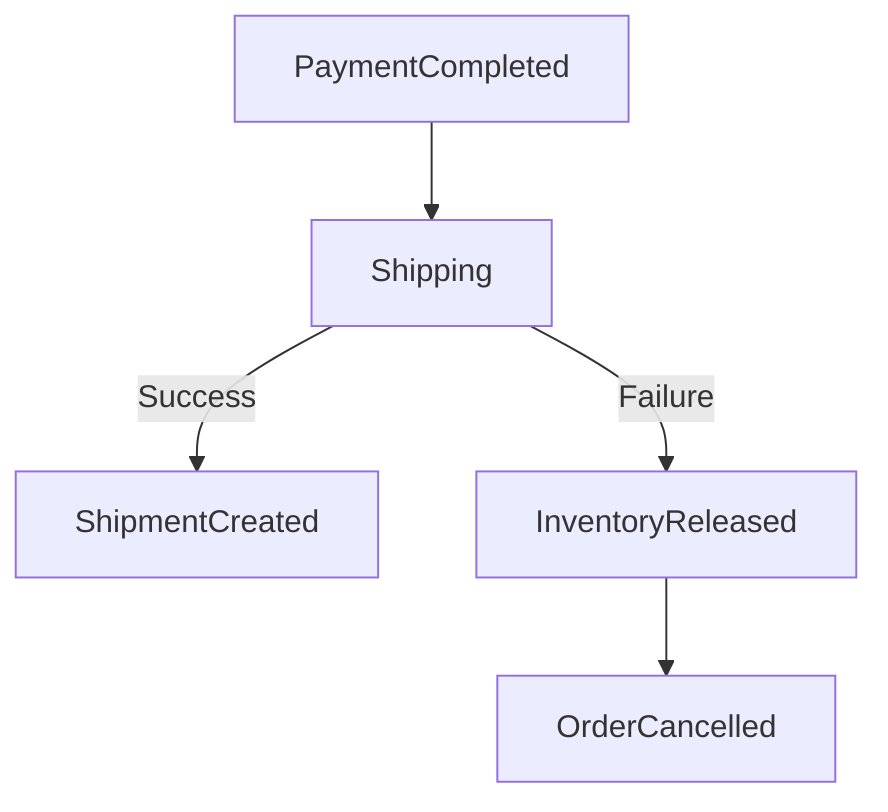
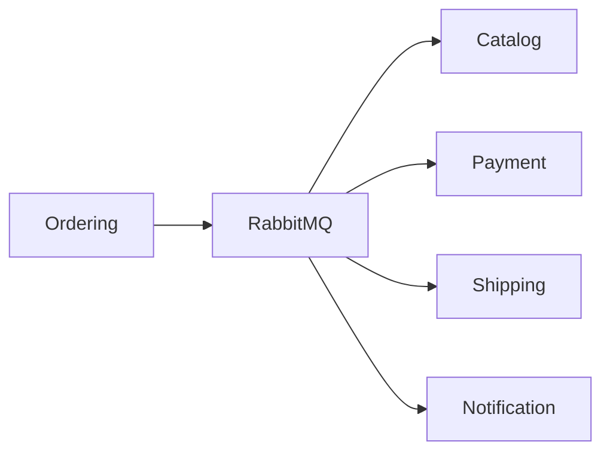
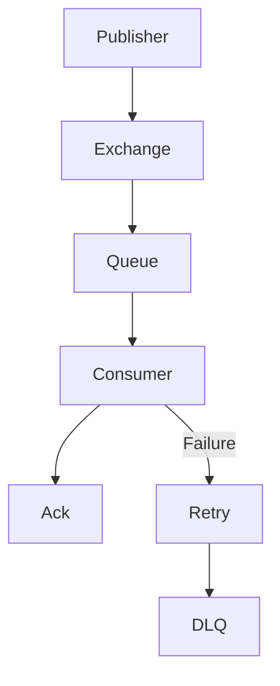

# Airmaster E-Commerce Platform

A scalable, event-driven e-commerce platform built with **ASP.NET Core 10**, **RabbitMQ**, **YARP API Gateway**, **SQL Server**, and **Saga Choreography**.

The solution demonstrates modern distributed system principles using a microservices architecture, asynchronous messaging, independent databases, and resilient communication patterns. It is intentionally designed to run locally using Docker without requiring paid cloud services while remaining extensible for production deployments.

---

# Table of Contents

1. Overview
2. Goals & Design Principles
3. System Architecture
4. Microservice Responsibilities
5. Database Design
6. Saga Choreography
7. Messaging Architecture
8. Security
9. Reliability & Resilience
10. Performance & Scalability
11. Technology Stack
12. Current Assessment Limitations
13. Future Enhancements
14. Conclusion

---

# 1. Overview

The **Airmaster E-Commerce Platform** is a cloud-ready microservices application demonstrating enterprise software architecture and distributed system design.

The platform separates business capabilities into independently deployable services that communicate asynchronously through RabbitMQ using the **Saga Choreography** pattern. Each service owns its own database, enabling loose coupling, independent scalability, and fault isolation.

Although the project is designed to execute locally for assessment purposes, the architecture follows cloud-native principles and can be extended for production environments.

## Functional Modules

- Identity & Authentication
- Product Catalog
- Order Management
- Payment Processing
- Shipping
- Notifications

---

# 2. Goals & Design Principles

## Goals

- Demonstrate Microservices Architecture
- Implement Event-Driven Communication
- Use Saga Choreography for distributed transactions
- Maintain loose coupling between services
- Support horizontal scalability
- Improve fault tolerance through asynchronous messaging
- Keep the solution lightweight enough to run locally

## Design Principles

- Domain-Driven Design (DDD)
- Database-per-Service Pattern
- Eventual Consistency
- Asynchronous Processing
- Independent Service Ownership
- Stateless APIs
- Fault Isolation
- High Cohesion & Low Coupling

---

# 3. System Architecture

The platform follows a decentralized microservices architecture.

Each business capability is implemented as an independent ASP.NET Core Web API. Communication between services occurs asynchronously through RabbitMQ events instead of direct synchronous HTTP calls whenever possible.

Authentication is centralized through the Identity Service, while all client requests enter the system through the YARP API Gateway.



## Architecture Characteristics

- API Gateway acts as the single entry point.
- Services are independently deployable.
- Each service owns its own database.
- RabbitMQ enables asynchronous communication.
- Saga Choreography coordinates long-running business transactions.
- SignalR provides real-time notifications to connected clients.
- Polly improves resilience when calling external dependencies.

---

# 4. Microservice Responsibilities

The platform follows the **Database-per-Service** pattern, where each microservice owns its business logic and persistence layer. Services communicate primarily through domain events published to RabbitMQ, reducing tight coupling and enabling eventual consistency.

| Service | Responsibilities | Database |
|----------|------------------|----------|
| **Gateway (YARP)** | Acts as the single entry point, routes requests to downstream services, applies CORS policies, authentication, and rate limiting. | None |
| **Identity.API** | User registration, authentication, JWT token generation, refresh tokens, role-based authorization, and profile management. | Airmaster_IdentityDb |
| **Catalog.API** | Product catalog, categories, pricing, inventory management, stock reservation, and compensating inventory updates during Saga execution. | Airmaster_CatalogDb |
| **Ordering.API** | Shopping cart checkout, order creation, order lifecycle management, and publishing domain events. | Airmaster_OrderingDb |
| **Payment.API** | Processes payments asynchronously, integrates with external payment providers, updates payment status, and publishes payment events. | Airmaster_PaymentDb |
| **Shipping.API** | Creates shipments, assigns carriers, generates tracking numbers, and publishes shipment events. | Airmaster_ShippingDb |
| **Notification.API** | Sends real-time order status notifications using SignalR and processes notification events. | None |

---

## Service Communication

The platform uses a combination of synchronous and asynchronous communication.

### Synchronous Communication

Used only when an immediate response is required.

Examples:

- User Login
- Product Search
- Product Details
- JWT Authentication
- Order Submission

Communication Path:

```text
Client
   │
HTTPS
   │
YARP API Gateway
   │
Target Service
```

---

### Asynchronous Communication

Long-running business operations are handled asynchronously using RabbitMQ.

Examples:

- Order Processing
- Inventory Reservation
- Payment Processing
- Shipment Creation
- Customer Notifications

Communication Path:

```text
Ordering API
      │
Publish Event
      │
RabbitMQ
      │
Subscribers
      ├── Catalog API
      ├── Payment API
      ├── Shipping API
      └── Notification API
```

Benefits:

- Loose coupling
- Better scalability
- Improved fault tolerance
- Independent service deployment
- Eventual consistency

---

## Database Ownership

Each microservice exclusively owns its database.

```text
Identity.API
     │
IdentityDb

Catalog.API
     │
CatalogDb

Ordering.API
     │
OrderingDb

Payment.API
     │
PaymentDb

Shipping.API
     │
ShippingDb
```

This prevents direct cross-service database access and ensures each bounded context remains independent.

---

## Event Ownership

Each service publishes and consumes only events related to its own domain.

| Service | Publishes | Consumes |
|----------|-----------|----------|
| Ordering | OrderCreated, OrderCancelled | PaymentCompleted, PaymentFailed, ShipmentCreated |
| Catalog | InventoryReserved, InventoryReleased, InventoryReservationFailed | OrderCreated, PaymentFailed, ShipmentFailed |
| Payment | PaymentCompleted, PaymentFailed | InventoryReserved |
| Shipping | ShipmentCreated, ShipmentFailed | PaymentCompleted |
| Notification | NotificationSent | ShipmentCreated, PaymentCompleted, PaymentFailed |

This event ownership model enables **Saga Choreography**, where each service reacts independently to domain events without requiring a centralized orchestration service.

---

# 5. Database Design

The platform follows the **Database-per-Service** pattern, where each microservice owns its own database. This design minimizes coupling, allows independent schema evolution, and prevents services from directly accessing each other's data.

Each database is managed independently using **Entity Framework Core Code-First Migrations**.

---

## Database Overview

| Service | Database | Purpose |
|----------|----------|---------|
| Identity.API | **Airmaster_IdentityDb** | User accounts, authentication, authorization |
| Catalog.API | **Airmaster_CatalogDb** | Products, categories, inventory |
| Ordering.API | **Airmaster_OrderingDb** | Orders and order items |
| Payment.API | **Airmaster_PaymentDb** | Payment transactions |
| Shipping.API | **Airmaster_ShippingDb** | Shipment tracking |
| Saga State | **Airmaster_SagaDb** | Reservation state and processed events |

---

## Catalog Database (Airmaster_CatalogDb)

### Product

| Column | Type | Description |
|----------|------|-------------|
| Id | GUID (PK) | Product identifier |
| Name | String | Product name |
| Description | String | Product description |
| Price | Decimal | Unit price |
| StockQuantity | Integer | Available inventory |
| ImageUrl | String | Product image |
| CategoryId | GUID (FK) | Associated category |

---

### Category

| Column | Type | Description |
|----------|------|-------------|
| Id | GUID (PK) | Category identifier |
| Name | String | Category name |
| Description | String | Category description |

---

## Ordering Database (Airmaster_OrderingDb)

### Order

| Column | Type | Description |
|----------|------|-------------|
| Id | GUID (PK) | Order identifier |
| UserId | GUID | Customer placing the order |
| OrderDate | DateTime | Order creation time |
| TotalAmount | Decimal | Total order value |
| Status | Enum | Pending, Paid, Shipped, Failed |
| ShippingAddress | String | Delivery address |
| PaidAtUtc | DateTime? | Payment timestamp |
| ShippedAtUtc | DateTime? | Shipment timestamp |
| TransactionId | String? | Payment transaction reference |
| TrackingNumber | String? | Shipment tracking number |
| Carrier | String? | Shipping carrier |

---

### OrderItem

| Column | Type | Description |
|----------|------|-------------|
| Id | GUID (PK) | Order item identifier |
| OrderId | GUID (FK) | Parent order |
| ProductId | GUID | Product identifier |
| ProductName | String | Product name at purchase time |
| Quantity | Integer | Purchased quantity |
| UnitPrice | Decimal | Product price at purchase time |

---

## Payment Database (Airmaster_PaymentDb)

### PaymentTransaction

| Column | Type | Description |
|----------|------|-------------|
| Id | GUID (PK) | Payment identifier |
| OrderId | GUID | Related order |
| UserId | GUID | Customer identifier |
| Amount | Decimal | Payment amount |
| TransactionStatus | String | Payment result |
| GatewayReference | String | External payment reference |
| ProcessedAtUtc | DateTime | Processing timestamp |

---

## Shipping Database (Airmaster_ShippingDb)

### Shipment

| Column | Type | Description |
|----------|------|-------------|
| Id | GUID (PK) | Shipment identifier |
| OrderId | GUID | Related order |
| UserId | GUID | Customer identifier |
| TrackingNumber | String | Shipment tracking number |
| Carrier | String | Shipping provider |
| ShippingStatus | String | Current shipment status |
| CreatedAtUtc | DateTime | Shipment creation time |

---

## Identity Database (Airmaster_IdentityDb)

### User

| Column | Type | Description |
|----------|------|-------------|
| Id | GUID (PK) | User identifier |
| Email | String | Login email |
| PasswordHash | String | Hashed password |
| FirstName | String | First name |
| LastName | String | Last name |
| Role | String | User role |
| RefreshToken | String? | JWT refresh token |
| RefreshTokenExpiryTime | DateTime? | Refresh token expiry |
| SecurityStamp | String | Token invalidation support |

---

## Saga State Store (Airmaster_SagaDb)

The Saga State Store maintains temporary data required for long-running distributed transactions.

Unlike business databases, this database stores workflow state used during Saga execution.

### OrderReservation

| Column | Type | Description |
|----------|------|-------------|
| OrderId | GUID (PK) | Order identifier |
| UserId | GUID | Customer identifier |
| TotalAmount | Decimal | Reserved amount |
| ReservedItemsJson | String | Reserved inventory snapshot |
| ReservedAtUtc | DateTime | Reservation timestamp |

---

### ProcessedEvents

This table provides **idempotency** by ensuring the same event is not processed multiple times.

| Column | Type | Description |
|----------|------|-------------|
| EventId | GUID (PK) | Event identifier |
| EventType | String | Event name |
| ProcessedAtUtc | DateTime | Processing timestamp |

---

## Database Design Principles

The database architecture follows several best practices:

- Database-per-Service pattern
- Independent schema evolution
- Loose coupling between services
- Eventual consistency through messaging
- Entity Framework Core Code-First Migrations
- GUID primary keys for distributed systems
- Foreign keys limited to each service boundary
- Business data isolated from Saga state

---

## Data Ownership

```text
Identity.API
    │
IdentityDb

Catalog.API
    │
CatalogDb

Ordering.API
    │
OrderingDb

Payment.API
    │
PaymentDb

Shipping.API
    │
ShippingDb

Saga State
    │
SagaDb
```

Each service exclusively owns its data and exposes functionality through APIs or domain events rather than direct database access.

---

# 6. Saga Choreography

The platform implements the **Saga Choreography** pattern to coordinate long-running distributed business transactions without using a centralized orchestrator.

Each microservice reacts independently to domain events published through RabbitMQ. Services perform their business logic, update their own database, and publish new events for downstream services.

This approach enables **eventual consistency**, **loose coupling**, and **independent service deployment**.

---

## Why Saga Choreography?

Traditional distributed transactions (2PC) tightly couple services and reduce scalability.

Instead, Saga Choreography coordinates the workflow using events.

Benefits include:

- No central orchestration service
- Loose coupling between services
- Better scalability
- Independent deployments
- Improved fault tolerance
- Event-driven communication

---

## Order Processing Workflow



---

## Event Flow

| Step | Service | Event |
|------|----------|-------|
| 1 | Ordering | OrderCreated |
| 2 | Catalog | InventoryReserved |
| 3 | Payment | PaymentCompleted |
| 4 | Shipping | ShipmentCreated |
| 5 | Notification | Customer Notified |

---

## Compensation Flow

If a downstream service fails after inventory has been reserved, compensating events restore system consistency.

### Payment Failure



Steps:

1. Inventory is reserved.
2. Payment processing fails.
3. Payment publishes **PaymentFailed**.
4. Catalog releases reserved inventory.
5. Ordering updates the order status to **Cancelled**.

---

### Shipping Failure



Steps:

1. Payment succeeds.
2. Shipment creation fails.
3. Shipping publishes **ShipmentFailed**.
4. Catalog restores inventory.
5. Ordering marks the order as **Cancelled**.

---

## Published Events

| Service | Events Published |
|----------|------------------|
| Ordering | OrderCreated, OrderCancelled |
| Catalog | InventoryReserved, InventoryReleased, InventoryReservationFailed |
| Payment | PaymentCompleted, PaymentFailed |
| Shipping | ShipmentCreated, ShipmentFailed |
| Notification | NotificationSent |

---

## Event Consumers

| Service | Events Consumed |
|----------|-----------------|
| Catalog | OrderCreated, PaymentFailed, ShipmentFailed |
| Payment | InventoryReserved |
| Shipping | PaymentCompleted |
| Notification | ShipmentCreated, PaymentCompleted, PaymentFailed |
| Ordering | PaymentCompleted, PaymentFailed, ShipmentCreated |

---

## Dead Letter Queue (DLQ)

Failed messages are automatically redirected to a **Dead Letter Exchange** after exhausting retry attempts.

```text
OrderCreated
      │
RabbitMQ Queue
      │
Consumer
      │
Failure
      │
Dead Letter Exchange
(AirmasterCentralExchange.DLX)
```

Benefits:

- Prevents message loss
- Enables manual replay
- Simplifies troubleshooting
- Isolates poison messages

---

## Idempotent Event Processing

RabbitMQ may deliver the same message more than once.

To prevent duplicate processing, the platform maintains a **ProcessedEvents** table.

Workflow:

```text
Receive Event
      │
Check ProcessedEvents
      │
Already Processed?
      │
Yes ─────► Ignore
      │
No
      │
Process Event
      │
Save EventId
```

This ensures duplicate payment, shipment, or inventory operations do not occur.

---

## Eventual Consistency

The platform intentionally avoids distributed database transactions.

Instead, each service:

1. Updates its own database.
2. Publishes a domain event.
3. Allows downstream services to react asynchronously.

Although updates are not committed simultaneously, the system eventually reaches a consistent state through Saga events and compensating transactions.

---

## Saga Characteristics

- Event-driven communication
- No distributed transactions
- Database-per-Service
- Independent service ownership
- Eventual consistency
- Compensating transactions
- Dead Letter Queue support
- Idempotent event processing
- Fault isolation
- Horizontally scalable

---

# 7. Messaging Architecture

The platform uses **RabbitMQ** as its message broker to enable asynchronous communication between microservices.

Instead of invoking downstream services through synchronous HTTP requests, services publish **domain events** that are consumed by interested subscribers. This approach reduces coupling, improves scalability, and enables eventual consistency across the system.

---

## Messaging Pattern

The platform follows the **Publish-Subscribe (Pub/Sub)** messaging model.

1. A service performs its business operation.
2. The service publishes a domain event to RabbitMQ.
3. RabbitMQ routes the event to interested subscribers.
4. Each subscriber processes the event independently.



---

## Why RabbitMQ?

RabbitMQ was selected because it provides:

- Reliable asynchronous messaging
- Decoupled communication
- Message durability
- Automatic message acknowledgements
- Dead Letter Queue support
- Horizontal scalability
- Publisher/Consumer model

---

## Event Publishing Flow

```text
Client
   │
Ordering API
   │
Save Order
   │
Publish OrderCreated
   │
RabbitMQ Exchange
   │
Queues
   │
Consumers
```

The Ordering service does not directly invoke downstream services. Instead, it publishes an **OrderCreated** event, allowing interested services to react independently.

---

## RabbitMQ Components

### Exchange

The exchange receives published events and routes them to queues.

Example:

```
AirmasterCentralExchange
```

---

### Queues

Each microservice owns its own queue.

Examples:

```
catalog.queue

payment.queue

shipping.queue

notification.queue
```

Each queue is consumed independently by its corresponding service.

---

### Routing Keys

Routing keys determine which queue receives a message.

Example:

```
order.created

inventory.reserved

payment.completed

payment.failed

shipment.created

shipment.failed
```

---

## Domain Events

| Event | Publisher | Consumer(s) |
|---------|-----------|-------------|
| OrderCreated | Ordering | Catalog |
| InventoryReserved | Catalog | Payment |
| InventoryReservationFailed | Catalog | Ordering |
| PaymentCompleted | Payment | Shipping, Ordering, Notification |
| PaymentFailed | Payment | Catalog, Ordering, Notification |
| ShipmentCreated | Shipping | Ordering, Notification |
| ShipmentFailed | Shipping | Catalog, Ordering |

---

## Message Lifecycle



---

## Dead Letter Queue (DLQ)

If a message cannot be processed after multiple retry attempts, RabbitMQ automatically routes it to the **Dead Letter Exchange (DLX)**.

```text
OrderCreated
      │
RabbitMQ Queue
      │
Consumer
      │
Processing Failure
      │
Retry
      │
Retry
      │
Retry
      │
Dead Letter Exchange
      │
Dead Letter Queue
```

Benefits:

- Prevents message loss
- Isolates poison messages
- Enables manual replay
- Simplifies troubleshooting

---

## Message Reliability

RabbitMQ provides several mechanisms to improve message reliability.

### Durable Queues

Queues survive broker restarts.

### Persistent Messages

Important business events are persisted until successfully processed.

### Manual Acknowledgements

Consumers explicitly acknowledge successful processing.

If processing fails, the message remains available for retry.

---

## Retry Strategy

Transient failures such as temporary database or network issues are automatically retried.

Examples include:

- Temporary SQL Server connectivity issues
- External payment gateway timeout
- Short-lived network interruptions

If retries continue to fail, the message is moved to the Dead Letter Queue.

---

## Event Ordering

Each event represents a completed business action.

For example:

```
OrderCreated

↓

InventoryReserved

↓

PaymentCompleted

↓

ShipmentCreated
```

Services process events in sequence while remaining independent from one another.

---

## Advantages of Event-Driven Messaging

Using RabbitMQ provides several architectural benefits:

- Loose coupling between services
- Independent deployments
- Improved scalability
- Better fault isolation
- Eventual consistency
- Faster HTTP responses
- Higher throughput
- Simplified integration of new services

---

## Current Assessment Scope

For this assessment project, RabbitMQ is deployed locally using Docker.

This keeps the solution lightweight while demonstrating the same event-driven architecture commonly used in production systems.

In a production environment, RabbitMQ can be clustered for high availability or replaced with another enterprise messaging platform such as Azure Service Bus or Apache Kafka without significant changes to the overall architecture.

---

# 8. Security

The platform applies multiple security measures to protect user data, secure APIs, and reduce common application vulnerabilities.

Security is implemented at multiple layers, including authentication, authorization, API protection, secure database access, and resilient communication.

---

## Authentication

User authentication is implemented using **JSON Web Tokens (JWT)**.

After a successful login, the Identity service generates a signed JWT that is included in subsequent API requests.

Authentication Flow:

```text
User Login
     │
Identity.API
     │
Validate Credentials
     │
Generate JWT
     │
Client
     │
Authorization: Bearer <token>
     │
API Gateway
     │
Protected APIs
```

JWT Benefits:

- Stateless authentication
- Scalable across multiple services
- No server-side session storage
- Suitable for distributed systems

---

## Authorization

Protected endpoints use **Role-Based Authorization (RBAC)**.

Examples:

| Role | Permissions |
|--------|-------------|
| Customer | Browse products, place orders, view order history |
| Admin | Dashboard, Product management, inventory updates, order management |

Authorization is enforced using ASP.NET Core authorization attributes.

Example:

```csharp
[Authorize(Roles = "Admin")]
```

---

## Token Security

JWT tokens include:

- User Identifier
- User Role
- Expiration Time
- Security Claims

Current configuration:

- HMAC-SHA256 signing
- SymmetricSecurityKey
- Token lifetime: **15 minutes**
- Refresh Tokens supported
- Security Stamp for token invalidation

These measures reduce the risk of token misuse while allowing secure session renewal.

---

## API Gateway Security

All client requests pass through the **YARP API Gateway**.

Responsibilities include:

- Request routing
- Authentication
- Authorization
- CORS policy enforcement
- Rate limiting

Centralizing these concerns simplifies downstream services and provides a consistent security layer.

---

## Rate Limiting

To reduce abuse and protect backend services, the API Gateway applies rate limiting.

### Token Bucket Limiter

Suitable for read-heavy endpoints.

Configuration:

- 20 tokens per client

---

### Fixed Window Limiter

Used for authentication and sensitive endpoints.

Configuration:

- 100 requests per minute

Benefits:

- Prevents API abuse
- Reduces denial-of-service risk
- Protects backend resources
- Promotes fair resource usage

---

## Password Security

Passwords are never stored in plain text.

ASP.NET Core Identity stores passwords as secure cryptographic hashes.

The application stores only:

- Password Hash
- Security Stamp

Plain-text passwords are never persisted.

---

## SQL Injection Prevention

All database operations are performed through **Entity Framework Core**.

Security is achieved using:

- LINQ queries
- Parameterized SQL
- Entity Framework change tracking

This significantly reduces the risk of SQL injection attacks.

---

## Secure Communication

Communication between clients and the platform is intended to use HTTPS.

Benefits include:

- Encryption in transit
- Protection against packet interception
- Secure JWT transmission

For local assessment environments, HTTP may be used during development.

---

## CORS Policy

Cross-Origin Resource Sharing (CORS) is configured at the API Gateway.

Benefits:

- Restricts unauthorized origins
- Protects browser-based clients
- Prevents unintended cross-origin requests

---

## Exception Handling

Unhandled exceptions are processed by centralized exception middleware.

Instead of exposing internal implementation details, APIs return standardized error responses.

Example:

```json
{
  "title": "Unexpected Server Error",
  "status": 500,
  "traceId": "...",
  "detail": "An unexpected error occurred."
}
```

This improves both security and client experience.

---

## Secure Configuration

Sensitive configuration values should not be hardcoded.

Examples include:

- JWT Signing Key
- Database Connection Strings
- RabbitMQ Credentials

For this assessment project, these values are stored in configuration files for local development.

In a production environment, they should be managed using a secure secret management solution such as Azure Key Vault or environment variables.

---

## Security Best Practices

The platform follows several secure development practices:

- JWT Authentication
- Role-Based Authorization
- Short-lived Access Tokens
- Refresh Token Support
- API Gateway Security
- Rate Limiting
- Entity Framework Parameterized Queries
- Password Hashing
- HTTPS Support
- CORS Protection
- Centralized Exception Handling

---

## Current Assessment Scope

This project is designed to run locally without paid cloud infrastructure.

Accordingly:

- Secrets are managed through local configuration.
- HTTPS may be disabled during local development.
- Single-node deployment is assumed.
- Authentication is implemented using JWT without external identity providers.

The architecture is designed so these components can be replaced with production-grade alternatives without significant changes to the overall system design.

---

# 9. Reliability & Resilience

Distributed systems must continue operating even when individual services experience failures. The Airmaster E-Commerce Platform incorporates several resilience patterns to improve reliability, recover gracefully from transient failures, and maintain eventual consistency.

---

## Resilience Strategy

The platform combines asynchronous messaging, retry policies, fault isolation, and compensating transactions to ensure business operations can continue despite temporary failures.

Implemented resilience mechanisms include:

- RabbitMQ asynchronous messaging
- Saga Choreography
- Polly retry policies
- Dead Letter Queue (DLQ)
- Idempotent event processing
- Independent service databases
- Health checks

---

## Polly Retry Policies

The platform uses **Polly** to automatically retry transient failures when communicating with external dependencies.

Examples include:

- Temporary database connectivity issues
- Payment gateway timeout
- Network interruptions
- HTTP 5xx responses

Example Retry Strategy:

```text
Request

↓

Failure

↓

Retry 1

↓

Retry 2

↓

Retry 3

↓

Failure Handling
```

Benefits:

- Reduces temporary failures
- Improves service availability
- Prevents unnecessary request failures

---

## Fault Isolation

Each microservice operates independently.

If one service becomes unavailable, other services continue functioning whenever possible.

Example:

```text
Payment Service Offline

↓

Catalog continues serving products

↓

Identity continues authenticating users

↓

Ordering accepts requests

↓

Payment resumes after recovery
```

This minimizes the impact of localized failures.

---

## Eventual Consistency

Instead of using distributed database transactions, the platform relies on asynchronous events.

Each service:

1. Updates its own database.
2. Publishes a domain event.
3. Downstream services react independently.

Although updates occur at different times, the system eventually reaches a consistent state.

---

## Compensating Transactions

Failures occurring during a Saga are handled through compensating events rather than database rollbacks.

Example:

```text
Order Created

↓

Inventory Reserved

↓

Payment Failed

↓

Inventory Released

↓

Order Cancelled
```

Benefits:

- Maintains business consistency
- Avoids distributed transactions
- Enables independent service recovery

---

## Idempotent Event Processing

RabbitMQ guarantees **at-least-once delivery**, meaning duplicate messages may occur.

Each consumer checks the **ProcessedEvents** table before processing an event.

Workflow:

```text
Receive Event

↓

Check EventId

↓

Already Processed?

↓

Yes → Ignore

↓

No

↓

Process Event

↓

Store EventId
```

This prevents duplicate inventory updates, duplicate payments, and duplicate shipments.

---

## Dead Letter Queue

Messages that repeatedly fail processing are moved to a Dead Letter Queue.

```text
Producer

↓

RabbitMQ Queue

↓

Consumer

↓

Processing Failure

↓

Retry

↓

Retry

↓

Retry

↓

Dead Letter Queue
```

Benefits:

- Prevents message loss
- Isolates poison messages
- Enables manual replay
- Simplifies troubleshooting

---

## Health Checks

ASP.NET Core Health Checks expose service health endpoints.

Recommended endpoints:

```
/health

/ready
```

Health checks verify:

- SQL Server connectivity
- RabbitMQ connectivity
- Service readiness

Benefits:

- Faster issue detection
- Easier monitoring
- Improved deployment validation

---

## Logging

Each service generates structured application logs.

Typical log entries include:

- Incoming requests
- Published events
- Consumed events
- Retry attempts
- Exceptions
- Saga transitions

Example:

```text
INFO

OrderCreated

OrderId: 1001

CorrelationId: a7f9...
```

Structured logging simplifies debugging in distributed environments.

---

## Correlation IDs

Each incoming request is assigned a unique Correlation ID.

The same identifier is propagated across:

- HTTP requests
- RabbitMQ events
- Background processing
- Application logs

Example:

```text
Client

↓

Gateway

↓

Ordering

↓

RabbitMQ

↓

Payment

↓

Shipping
```

Benefits:

- End-to-end request tracing
- Faster troubleshooting
- Easier distributed debugging

---

## Independent Deployments

Because services communicate through events rather than direct database access, they can be deployed independently.

Benefits include:

- Zero impact deployments
- Independent scaling
- Smaller deployment units
- Reduced downtime

---

## Reliability Summary

The platform improves reliability through:

- Saga Choreography
- RabbitMQ asynchronous messaging
- Polly retry policies
- Dead Letter Queue
- Idempotent event processing
- Fault isolation
- Eventual consistency
- Independent databases
- Health checks
- Correlation IDs

---

## Production Considerations

The current assessment project demonstrates these resilience patterns using local Docker containers.

In a production deployment, additional improvements could include:

- Outbox Pattern
- Distributed tracing (OpenTelemetry)
- Centralized logging (Serilog + Application Insights)
- Circuit Breaker policies
- Multi-node RabbitMQ clustering
- Kubernetes health probes

---

# 10. Performance & Scalability

The Airmaster E-Commerce Platform is designed using cloud-native architectural principles that support horizontal scalability, efficient resource utilization, and high throughput.

Although this assessment is intended to run on a single development machine, the architecture allows individual services to scale independently based on workload.

---

## Scalability Strategy

Each microservice is stateless and independently deployable.

This enables horizontal scaling where multiple instances of the same service can run simultaneously behind a load balancer.

```text
                Client Requests
                      │
                      ▼
              YARP API Gateway
                      │
      ┌───────────────┼───────────────┐
      ▼               ▼               ▼
 Ordering #1     Ordering #2     Ordering #3
      │               │               │
      └───────────────┼───────────────┘
                      ▼
                  RabbitMQ
```

Benefits:

- Independent service scaling
- Improved throughput
- Better fault tolerance
- Reduced request latency

---

## Stateless Services

All APIs are designed to be stateless.

Each request contains all information required for processing.

User authentication relies on JWT rather than server-side sessions.

Benefits:

- Easier horizontal scaling
- No session affinity
- Simplified deployments
- Improved reliability

---

## Database Scalability

Each microservice owns its own database.

```text
Identity.API
     │
IdentityDb

Catalog.API
     │
CatalogDb

Ordering.API
     │
OrderingDb

Payment.API
     │
PaymentDb

Shipping.API
     │
ShippingDb
```

Benefits:

- Independent schema evolution
- Reduced database contention
- Easier maintenance
- Better fault isolation

---

## Asynchronous Processing

Long-running operations are executed asynchronously through RabbitMQ.

Examples include:

- Inventory Reservation
- Payment Processing
- Shipment Creation
- Customer Notifications

Instead of blocking HTTP requests, services publish events and continue processing independently.

Benefits:

- Faster API responses
- Better resource utilization
- Higher throughput
- Reduced request time

---

## Read vs Write Workloads

The platform naturally separates read-heavy and write-heavy operations.

### Read Operations

Examples:

- Product Catalog
- Product Details
- Categories
- User Profile

These operations are lightweight and return responses immediately.

---

### Write Operations

Examples:

- Order Placement
- Inventory Reservation
- Payment Processing
- Shipment Creation

These operations involve multiple services and are coordinated through Saga Choreography.

---

## Caching

The current assessment project uses **IMemoryCache** to reduce repeated database queries for frequently accessed reference data.

Typical cache candidates include:

- Product Categories
- Product Details
- Application Configuration

Benefits:

- Lower database load
- Faster response times
- Reduced latency

For distributed production deployments, IMemoryCache can be replaced with Redis without changing the application architecture.

---

## API Gateway Performance

YARP acts as the single entry point for client requests.

Responsibilities include:

- Request routing
- Authentication
- Authorization
- Load balancing
- Rate limiting

Centralizing these concerns keeps downstream services focused on business logic.

---

## Message Queue Performance

RabbitMQ improves system performance by decoupling services.

Instead of waiting for downstream processing, the Ordering service publishes an event and immediately returns control.

Example:

```text
Client

↓

Ordering API

↓

Save Order

↓

Publish Event

↓

HTTP 201 Created
```

Background services continue processing payment, shipping, and notifications asynchronously.

---

## Concurrency Handling

The platform is designed to support concurrent order processing.

Inventory updates should use optimistic concurrency to prevent overselling when multiple customers purchase the same product simultaneously.

Benefits:

- Prevents race conditions
- Maintains inventory accuracy
- Supports concurrent requests

---

## Resource Isolation

Each microservice executes independently.

Heavy processing within one service does not directly impact other services.

Example:

```text
Payment Service Busy

↓

Catalog Service

Normal

↓

Identity Service

Normal

↓

Notification Service

Normal
```

This improves overall platform stability.

---

## Deployment Scalability

Since services are containerized with Docker, each service can be scaled independently.

Example:

```text
3 × Catalog API

2 × Ordering API

5 × Notification API

1 × Identity API
```

Scaling decisions depend on workload rather than scaling the entire application.

---

## Current Assessment Scope

This project is intentionally optimized for local execution.

Current implementation includes:

- Single RabbitMQ instance
- Single SQL Server instance
- Docker containers
- IMemoryCache
- Single-node deployment

Despite these constraints, the architecture demonstrates scalable design principles suitable for enterprise systems.

---

## Future Production Enhancements

The architecture can be extended with:

- Redis Distributed Cache
- Kubernetes (AKS)
- Azure Container Apps
- Azure SQL Database
- RabbitMQ Cluster
- OpenTelemetry
- Distributed tracing
- Horizontal autoscaling
- CDN for static content

These enhancements are intentionally outside the scope of this assessment but can be introduced without significant architectural changes.

---

# 11. Technology Stack

The Airmaster E-Commerce Platform is built using modern .NET technologies and open-source tools suitable for developing distributed microservices applications.

| Category | Technology |
|----------|------------|
| Framework | ASP.NET Core 9 |
| Language | C# 13 |
| Runtime | .NET 9 |
| ORM | Entity Framework Core 9 |
| Database | SQL Server |
| API Gateway | YARP (Yet Another Reverse Proxy) |
| Authentication | JWT Bearer Authentication |
| Authorization | ASP.NET Core Identity + Role-Based Authorization |
| Messaging | RabbitMQ |
| Distributed Transactions | Saga Choreography |
| Real-Time Communication | SignalR |
| Resilience | Polly |
| Caching | IMemoryCache |
| Containerization | Docker |
| API Documentation | Swagger / OpenAPI |
| Logging | Microsoft.Extensions.Logging |
| Configuration | appsettings.json + Environment Variables |
| Version Control | Git |
| IDE | Visual Studio 2022 |

---

## Project Architecture

- Microservices Architecture
- Domain-Driven Design (DDD)
- Database-per-Service Pattern
- Event-Driven Architecture
- Saga Choreography
- Publish/Subscribe Messaging
- Stateless APIs
- Eventual Consistency

---

## Communication Technologies

| Communication Type | Technology |
|--------------------|------------|
| Client → API | HTTPS |
| Gateway → Services | HTTP |
| Service → Service | RabbitMQ Events |
| Real-Time Updates | SignalR |

---

# 12. Current Assessment Limitations

This project is intentionally designed to run on a local development environment without requiring paid cloud infrastructure.

The primary objective is to demonstrate distributed system architecture and microservices design principles rather than production-scale infrastructure.

Current limitations include:

- Single-node deployment
- Local SQL Server instance
- Local RabbitMQ instance
- Docker Compose for orchestration
- IMemoryCache instead of distributed caching
- Configuration stored in appsettings.json for local development
- Built-in ASP.NET Core logging
- No centralized monitoring or distributed tracing
- No Kubernetes orchestration
- No cloud-managed infrastructure

These limitations are intentional to keep the project lightweight, reproducible, and easy to evaluate.

Despite these constraints, the architectural patterns remain the same as those used in enterprise production systems.

---

# 13. Future Enhancements

The current implementation provides a strong foundation for an event-driven microservices platform.

Potential production enhancements include:

## Infrastructure

- Azure Container Apps
- Azure SQL Database
- Azure Service Bus
- Kubernetes (AKS)
- Redis Distributed Cache

---

## Observability

- OpenTelemetry
- Application Insights
- Serilog
- Centralized Log Aggregation
- Distributed Tracing

---

## Reliability

- Outbox Pattern
- Circuit Breaker Policies
- Bulkhead Isolation
- Advanced Retry Policies
- Automatic Message Replay

---

## Security

- Azure Key Vault
- OAuth 2.0 / OpenID Connect
- Multi-Factor Authentication (MFA)
- Secret Rotation
- API Threat Protection

---

## Performance

- Distributed Caching
- CDN Integration
- Read Replicas
- Horizontal Auto Scaling
- Background Batch Processing

---

## DevOps

- CI/CD Pipelines
- Infrastructure as Code
- Automated Integration Testing
- Blue-Green Deployments
- Canary Releases

These enhancements can be incorporated without major architectural changes because the platform follows loosely coupled microservices and event-driven design principles.

---

# 14. Conclusion

The **Airmaster E-Commerce Platform** demonstrates modern enterprise software architecture using **ASP.NET Core 9**, **RabbitMQ**, **YARP API Gateway**, and **Saga Choreography**.

The solution applies several established architectural patterns, including:

- Microservices Architecture
- Database-per-Service Pattern
- Event-Driven Communication
- Publish/Subscribe Messaging
- Saga Choreography
- Eventual Consistency
- Stateless APIs
- Independent Service Ownership

Each microservice owns its business logic and persistence layer while communicating asynchronously through domain events. This design minimizes coupling, improves maintainability, and allows services to evolve independently.

Although the project is intentionally designed for local execution using Docker, SQL Server, RabbitMQ, and IMemoryCache, it follows cloud-native architectural principles and can be extended for production deployments with technologies such as Kubernetes, Redis, Azure Container Apps, Azure SQL Database, and OpenTelemetry.

The project successfully demonstrates how modern distributed systems can achieve scalability, reliability, and fault tolerance without relying on distributed transactions, making it a strong reference implementation for enterprise-grade .NET microservices development.

---

## Key Architectural Highlights

- ASP.NET Core 9 Microservices
- RabbitMQ Event Bus
- Saga Choreography Pattern
- Database-per-Service
- Event-Driven Architecture
- YARP API Gateway
- JWT Authentication
- SignalR Notifications
- Polly Resilience Policies
- Docker Containerization
- Entity Framework Core
- SQL Server
- IMemoryCache
- RESTful APIs
- Swagger Documentation

---

## Learning Outcomes

This project demonstrates practical implementation of:

- Microservices Design
- Distributed Transactions using Saga Choreography
- Event-Driven Systems
- Asynchronous Messaging
- Domain Isolation
- API Gateway Pattern
- Authentication & Authorization
- Fault Tolerance
- Reliability Patterns
- Cloud-Ready Application Design

---
